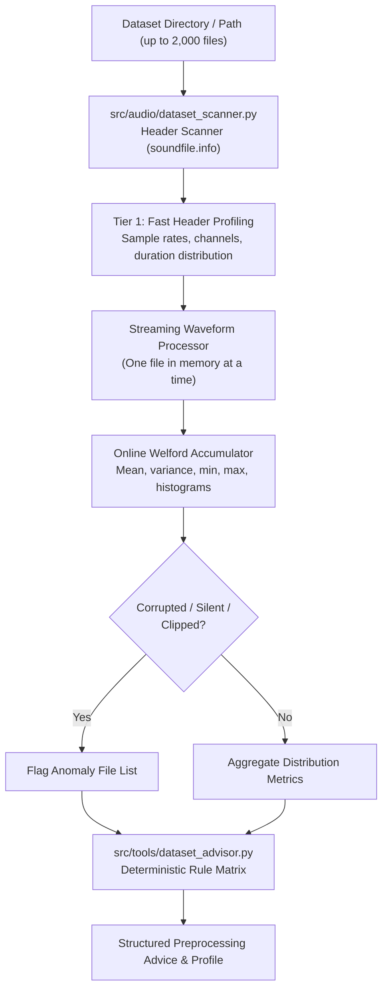

# AuralQ — Dataset Ingestion & Preprocessing Recommendation Engine Specification

**Status**: FROZEN & APPROVED  
**Reviewer Role**: Principal Audio AI Engineer & Academic Capstone Reviewer  
**Scope**: Dataset Ingestion, Streaming Acoustic Profiler & Deterministic Preprocessing Advisor  
**Hardware Envelope**: Laptop RTX 3050 (4 GB VRAM), AMD Ryzen 5 5600H, 16 GB RAM (Strict < 100 MB RAM budget for profiler)  

---

## 1. Executive Objective
Extend AuralQ's ingestion and tool architecture to support **Dual-Mode Operation**:
1. **Single Audio Mode**: Ingest a single audio file and query specific acoustic properties via the 8 core DSP tools (Milestone E1).
2. **Dataset Mode**: Ingest a directory of audio files, stream-process files with a strict sub-100 MB memory ceiling, compute dataset-wide acoustic distributions, detect anomalies (silent/clipped files), and generate a **deterministic, evidence-grounded Preprocessing Recommendation Report**.

---

## 2. Memory Architecture & Streaming Pipeline



### Hardware Safety Protocol (Sub-100 MB RAM Ceiling)
- **Zero Full-Corpus Loading**: Audio waveforms are decoded strictly one at a time and garbage-collected immediately. At no point are multiple decoded waveforms stored concurrently in RAM.
- **Online Welford Algorithm**: Running mean and sample variance are updated incrementally:
  $$M_k = M_{k-1} + \frac{x_k - M_{k-1}}{k}$$
  $$S_k = S_{k-1} + (x_k - M_{k-1})(x_k - M_k)$$
  $$\sigma^2 = \frac{S_k}{k - 1}$$
- **Dataset Scale Envelope**: Tested and guaranteed for up to **2,000 audio files / 5 GB on disk**.

---

## 3. Two-Tier Acoustic Profiling Suite

### Tier 1: Fast Header Scan (100% of files, ~1000 files/sec)
- Sample Rate Distribution: Counts of unique sample rates (e.g. `{16000: 450, 44100: 50}`).
- Channel Layout Distribution: Counts of mono, stereo, multi-channel files.
- File Formats: Distribution of file extensions (`.wav`, `.mp3`, `.flac`, `.ogg`).
- Duration Statistics: Min, max, mean, median, standard deviation, and interquartile range (IQR).

### Tier 2: Streamed Acoustic & Hygiene Pass (>10-15 files/sec on Ryzen 5 5600H)
- **Loudness & Dynamic Range**: RMS dBFS distribution, mean dBFS, dynamic range variance.
- **Signal Quality & Anomalies**:
  - Silent file count & file paths ($\text{dBFS} < -60.0$).
  - Clipped file count & file paths (runs $\ge 3$ at $|y| \ge 0.99$ with ratio $> 0.1\%$).
  - DC bias distribution ($\text{mean}(y)$).
- **Spectral Envelope & Tonality**:
  - Spectral Centroid distribution (perceived brightness across the corpus).
  - Spectral Flatness distribution (tonal recordings vs noise-dominated recordings).

---

## 4. Deterministic Preprocessing Recommendation Matrix

All preprocessing advice is derived deterministically from explicit mathematical thresholds:

| Condition in Dataset | Trigger Rule | Recommended Action | Engineering Justification & Parameters |
| :--- | :--- | :--- | :--- |
| **Mixed Sample Rates** | `len(unique_sample_rates) > 1` | `RESAMPLE` | Standardize all files to target rate (e.g. 22,050 Hz or modal rate) to prevent model input mismatch. |
| **Multi-Channel Audio** | `any(channels > 1)` | `MONO_DOWNMIX` | Downmix stereo/multi-channel to mono via equal-power summing ($0.707 \times (L+R)$) to avoid channel phase cancellation. |
| **Duration Variance** | $(\text{max} - \text{min}) / \text{median} > 0.5$ | `CHUNKING_OR_PADDING` | Segment long files into uniform windows (e.g. 5.0s with 50% overlap) or pad short files to prevent batch tensor padding inefficiency. |
| **Loudness Imbalance** | $\sigma(\text{RMS}) > 6.0\text{ dB}$ | `LOUDNESS_NORMALIZATION` | Apply peak normalization (-1.0 dBFS) or LUFS / RMS normalization to eliminate training loss bias from volume discrepancies. |
| **DC Bias / Sub-Bass Rumble** | $\text{mean}(\|DC\|) > 0.005$ | `HIGH_PASS_FILTER` | Apply 2nd-order Butterworth high-pass filter at 50–80 Hz to eliminate DC offset and sub-audible rumble. |
| **Clipped Recordings** | `clipped_count > 0` | `PRUNE_OR_DECLIP` | Isolate clipped files; recommend declipping interpolation or discarding severely clipped samples ($>1\%$ clipping ratio). |
| **Silent Recordings** | `silent_count > 0` | `PRUNE_SILENCE` | Prune identified silent files from the dataset to prevent zero-gradient training failure. |

---

## 5. Structured Pydantic v2 Schema Contract

### `DatasetProfileModel`
```python
class DatasetProfileModel(BaseModel):
    total_files: int
    total_duration_hours: float
    format_counts: dict[str, int]
    sample_rate_counts: dict[int, int]
    channel_counts: dict[int, int]
    duration_stats: dict[str, float]  # min, max, mean, median, std_dev, iqr
    rms_dbfs_stats: dict[str, float]
    spectral_centroid_mean_hz: float
    spectral_flatness_mean: float
    silent_files: list[str]
    clipped_files: list[str]
    processing_time_sec: float
```

### `PreprocessingAdviceModel`
```python
class PreprocessingAdviceModel(BaseModel):
    action: str  # RESAMPLE, MONO_DOWNMIX, CHUNKING_OR_PADDING, LOUDNESS_NORMALIZATION, etc.
    priority: Literal["CRITICAL", "RECOMMENDED", "OPTIONAL"]
    reason: str
    affected_files_count: int
    affected_files_percentage: float
    parameters: dict[str, Any]
    canonical_citations: list[str]
```

### `DatasetAdvisorResultModel`
```python
class DatasetAdvisorResultModel(BaseModel):
    dataset_path: str
    profile: DatasetProfileModel
    recommendations: list[PreprocessingAdviceModel]
    executive_summary: str
    status: Literal["success", "empty_dataset", "error"]
    warnings: list[str] = Field(default_factory=list)
```

---

## 6. Testing & Acceptance Criteria
1. **Synthetic Multi-File Fixture**:
   - Generate a temporary directory of 10 synthetic WAV files with varied sample rates (16 kHz, 22.05 kHz), stereo and mono channels, one silent file, and one clipped sine wave.
2. **Deterministic Correctness**:
   - `test_dataset_profiler_detection`: Verifies exact detection of silent file, clipped file, sample rate divergence, and channel divergence.
   - `test_dataset_advisor_recommendations`: Verifies that `RESAMPLE`, `MONO_DOWNMIX`, `PRUNE_SILENCE`, and `PRUNE_OR_DECLIP` are triggered with correct affected file counts and priorities.
3. **Memory Safety & Throughput**:
   - Execution finishes under 3.0 seconds for the synthetic corpus with zero memory leak or unclosed file handles.

---

## 7. Scope Freeze Confirmation
- **IN SCOPE**:
  - `src/audio/dataset_scanner.py`: Streaming directory scanner and file metadata extractor.
  - `src/tools/dataset_profiler.py`: Two-tier acoustic profiler with online Welford statistics.
  - `src/tools/dataset_advisor.py`: Deterministic heuristic recommendation engine.
  - Registry integration in `src/tools/registry.py` under tool name `dataset_profiler`.
  - Comprehensive unit test suite in `tests/test_dataset_profiler.py`.
- **OUT OF SCOPE (Deferred to E2/E7)**:
  - Streaming audio waveform file conversion/export on disk (profiler only *recommends* transformations; destructive dataset rewriting is done via explicit user scripts/UI).

