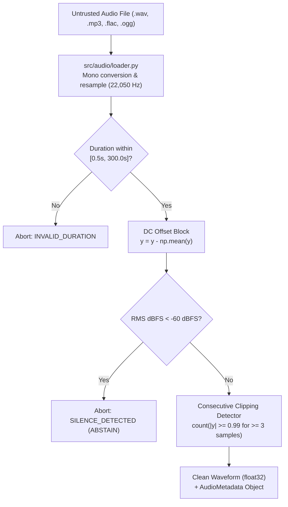

# AuralQ — Milestone E1 Specification & Scope Freeze

**Status**: FROZEN & APPROVED  
**Reviewer Role**: Principal Audio AI Engineer & Academic Capstone Reviewer  
**Target Milestone**: Evolution 1 (E1) — Audio Foundation & Pure DSP Core Engine  
**Hardware Envelope**: Laptop RTX 3050 (4 GB VRAM), AMD Ryzen 5 5600H, 16 GB RAM  

---

## 1. Executive Milestone Scope (E1)
Milestone E1 establishes the deterministic, mathematical bedrock of AuralQ before any stochastic LLM orchestration or agentic dispatch is introduced. 

### Deliverables
1. **Layer 1: Ingestion & Audio Hygiene Engine** (`src/audio/`)
   - `loader.py`: Safe format hygiene, mono conversion, resampling to target sample rate (default 22,050 Hz).
   - `validation.py`: Silence detection, DC-offset blocking, consecutive-sample clipping detection, duration bounds.
2. **Layer 3: Deterministic DSP Tool Suite** (`src/tools/`)
   - 8 core tools: `rms_energy`, `zero_crossing_rate`, `spectral_centroid`, `spectral_bandwidth`, `spectral_rolloff`, `spectral_flatness`, `mfcc`, `spectrogram`.
   - `registry.py`: Strict tool allowlist, parameter schemas, and metadata catalog.
   - Pydantic v2 schemas for all tool inputs (`ToolArgsModel`) and tool outputs (`ToolResultModel`).
   - Deterministic rule-based psychoacoustic perceptual anchors.
   - Canonical citation alias generator for regex validation compatibility.
3. **Comprehensive Synthetic Test Harness** (`tests/test_tools.py` and `tests/test_audio.py`)
   - Closed-form analytical test signals generated purely via NumPy and SciPy.
   - Zero external audio file dependencies.

---

## 2. Layer 1: Ingestion & Audio Hygiene Specification



### Hygiene Protocol & Edge Case Defense
- **DC Offset Removal**: Signals undergo mean-subtraction prior to any energy calculations to prevent false positive silence bypass.
- **Silence Gate**: Measured via RMS relative to full scale:
  $$\text{dBFS} = 20 \log_{10}(\text{RMS} + \epsilon)$$
  If $\text{dBFS} < -60.0$, the file is marked unanalyzable (`status: ABSTAIN`, reason: `AUDIO_SILENT`).
- **Consecutive Sample Clipping Detection**:
  - Sample-level peak threshold: $|y[n]| \ge 0.99$.
  - Detection criterion: Runs of $\ge 3$ consecutive saturated samples (flat-topping).
  - Saturation ratio threshold: $> 0.1\%$ of total audio duration.
  - Action: **Non-fatal warning**. Inject `CLIPPING_WARNING` into `AudioMetadata.warnings`. This alerts downstream spectral tools that high-frequency harmonics are artificially contaminated by non-linear distortion.

---

## 3. Layer 3: DSP Interface Contract & Schema Sanitization

### Architectural Firewall
> [!IMPORTANT]
> `src/tools/` must NEVER import `src/llm` or `src/agent/`. All tools are pure mathematical functions taking `(waveform: np.ndarray, sr: int, args: ToolArgsModel)` and returning `ToolResultModel`.

### Universal Tool Output Schema
```python
class ToolResultModel(BaseModel):
    tool: str
    status: Literal["success", "insufficient_samples", "dsp_error"]
    parameters: dict[str, Any]
    result: dict[str, float | int | str | list[float]]
    perceptual_anchors: dict[str, str]
    citation_aliases: dict[str, list[str]]
    execution_time_ms: float
    warnings: list[str] = Field(default_factory=list)
```

### Schema Leakage & Memory Defense
- **Type Coercion**: NumPy scalars (`np.float32`, `np.int64`) are explicitly cast to native Python `float` and `int` rounded to 4 decimal places.
- **NaN / Inf Neutralization**: Array aggregations are sanitized (`np.nan_to_num`), preventing JSON serialization errors or corrupted prompt strings.
- **Sample Length Guard**: If signal duration $< \text{window\_size}$ (`n_fft`), return structured `status: "insufficient_samples"` instead of throwing an unhandled exception.

---

## 4. Psychoacoustic Anchors & Dual Citation Aliasing

### Deterministic Perceptual Anchor Mapping
To eliminate LLM hallucination of qualitative terms, tools compute deterministic perceptual anchors:
- **`spectral_centroid`**:
  - $< 1200\text{ Hz} \rightarrow \text{"dark / warm"}$
  - $1200 - 3500\text{ Hz} \rightarrow \text{"balanced / neutral"}$
  - $> 3500\text{ Hz} \rightarrow \text{"bright / sharp"}$
- **`spectral_flatness`**:
  - $< 0.05 \rightarrow \text{"strongly tonal / harmonic"}$
  - $0.05 - 0.25 \rightarrow \text{"moderately tonal"}$
  - $> 0.25 \rightarrow \text{"noise-like / diffuse"}$
- **`rms_energy`**:
  - Dynamic range coefficient of variation ($CV = \frac{\sigma}{\mu}$):
    - $CV < 0.15 \rightarrow \text{"consistent / steady loudness"}$
    - $CV \ge 0.15 \rightarrow \text{"fluctuating / dynamic amplitude"}$

### Dual Citation Aliasing (Regex Robustness)
Every numeric measurement includes a dictionary of canonical citation tokens to prevent regex verification mismatches downstream:
```json
{
  "mean_hz": 4210.3,
  "citation_aliases": {
    "mean_hz": ["4210.3", "4210", "4210.3 Hz", "4210 Hz", "4.2 kHz", "4.21 kHz"]
  }
}
```

---

## 5. Memory & Artifact Discipline (Spectrogram)
- **Decoupled Payloads**: Spectrogram returns statistical band energies (low $< 500\text{ Hz}$, mid $500-3000\text{ Hz}$, high $> 3000\text{ Hz}$) in JSON memory ($< 2\text{ KB}$).
- **Headless Figure Management**: If visual export is requested, Matplotlib renders using the non-interactive `Agg` backend, saves a compressed PNG to disk, and calls `plt.close(fig)` immediately, returning only the file path. No figure objects or 2D spectrogram matrices remain resident in RAM.

---

## 6. Analytical Verification Suite (`tests/test_tools.py`)

All tests use synthetic, closed-form test waveforms:
1. **Pure Sine Wave ($1000\text{ Hz}, A=0.5, \text{SR}=22050$)**:
   - $\text{RMS} = \frac{0.5}{\sqrt{2}} \approx 0.3536 \pm 1\%$
   - $\text{Spectral Centroid} = 1000\text{ Hz} \pm 2\%$
   - $\text{Spectral Flatness} < 0.01$
2. **Gaussian White Noise**:
   - $\text{Spectral Flatness} \ge 0.40$
   - $\text{Zero Crossing Rate} \ge 0.25$
   - $\text{Spectral Centroid} \approx \frac{\text{SR}}{4} = 5512.5\text{ Hz} \pm 15\%$
3. **Pure Silence ($y = \mathbf{0}$)**:
   - Ingestion raises `AUDIO_SILENT` error code; zero-division gracefully handled.
4. **Clipped Sine Wave**:
   - Waveform pushed to $A=1.5$ and clipped at $[-0.99, 0.99]$; consecutive clipping detector triggers `CLIPPING_WARNING`.
5. **Linear Sine Sweep (Chirp: $200\text{ Hz} \rightarrow 4000\text{ Hz}$)**:
   - Verifies monotonic progression of spectral centroid across time windows.

---

## 7. Scope Freeze Confirmation
- **IN SCOPE for E1**:
  - `src/audio/loader.py`, `src/audio/validation.py`
  - `src/tools/energy.py`, `src/tools/spectral.py`, `src/tools/temporal.py`, `src/tools/timbre.py`, `src/tools/visual.py`, `src/tools/registry.py`
  - `tests/test_audio.py`, `tests/test_tools.py`
- **OUT OF SCOPE for E1 (Deferred to E2/E3)**:
  - Ollama client and prompt templates (`src/llm/`)
  - Agent state machine and tool planner (`src/agent/`)
  - Streamlit UI (`app/`)
